# ProspectScan - Guía de Uso

**Contextual Decision Intelligence for Cybersecurity**

## 🚀 Quick Start

### 1. Iniciar API

```bash
uvicorn api:app --host 0.0.0.0 --port 8000
```

### 2. Verificar salud

```bash
curl http://localhost:8000/api/health
```

## 📤 Pipeline de 5 Capas

### CAPA 1+2: Ingesta ZoomInfo → Contexto Empresarial

Sube un reporte Excel de ZoomInfo:

```bash
curl -X POST "http://localhost:8000/api/ingesta/upload" \
  -F "file=@/path/to/zoominfo_report.xlsx"
```

**Respuesta:**
```json
{
  "status": "success",
  "snapshot_id": "snapshot_20260105_163403_36e0f33c",
  "empresas_count": 5,
  "dominios": ["chedraui.com.mx", "bbva.mx", "walmex.mx"],
  "timestamp": "2026-01-05T16:34:03.123456"
}
```

**Columnas soportadas del Excel ZoomInfo:**
- `Company Name` / `company_name` → Nombre empresa
- `Website` / `website` → Dominio
- `Industry` / `industry` → Industria
- `Employees` / `employee_range` → Rango empleados
- `Revenue` / `revenue_range` → Ingresos
- `Employee Growth (YoY)` / `employee_growth_12m` → Crecimiento
- `Technologies` / `technologies` → Tech stack
- `ZoomInfo Company ID` / `company_id` → ID ZoomInfo

### CAPA 3+4: Análisis Seguridad → Cruce Semántico

Ejecuta el cruce para todos los dominios del snapshot:

```bash
curl -X POST "http://localhost:8000/api/cruce/batch?snapshot_id=snapshot_20260105_163403_36e0f33c&prioridad_minima=media"
```

**Parámetros:**
- `snapshot_id`: ID del snapshot creado en paso anterior
- `prioridad_minima`: Filtro (critica, alta, media, baja, descartada)

**Respuesta:**
```json
{
  "disclaimer": "Fuente de datos: ZoomInfo...",
  "total_procesados": 5,
  "total_filtrados": 2,
  "resultados": [
    {
      "dominio": "walmex.mx",
      "prioridad": "media",
      "score_oportunidad": 83,
      "momento_oportuno": true,
      "budget_estimado": {"min": 50000, "max": 150000},
      "talking_points": [...],
      "contexto": {...},
      "postura": {...}
    }
  ]
}
```

### Consultar Resultado Individual

```bash
curl http://localhost:8000/api/cruce/walmex.mx
```

## 🎯 Análisis Ad-Hoc (Sin Excel)

Para probar con un dominio individual:

```bash
curl -X POST "http://localhost:8000/api/cruce/analizar?dominio=example.com&industria=retail&estado=en_crecimiento&señales=funding"
```

**Parámetros:**
- `dominio`: Dominio a analizar
- `industria`: retail, banking, healthcare, technology, etc.
- `estado`: estable, en_crecimiento, en_transicion, ma_activo, en_contraccion
- `señales`: funding, hiring (separados por coma)

## 📊 Interpretación de Resultados

### Prioridades

| Prioridad | Score | Acción |
|-----------|-------|--------|
| 🔴 CRÍTICA | 90-100 | Actuar inmediatamente |
| 🟠 ALTA | 80-89 | Priorizar esta semana |
| 🟡 MEDIA | 60-79 | Revisar en 2 semanas |
| 🟢 BAJA | 40-59 | Monitorear |
| ⚪ DESCARTADA | 0-39 | No es momento |

### Score de Oportunidad

El score combina:
- **Estado organizacional** (M&A, crecimiento, transición)
- **Postura de seguridad** (básica = mayor oportunidad)
- **Presión externa** (regulación, industria)
- **Señales de inversión** (funding, hiring)

### Budget Estimado por Industria

| Industria | Rango Anual (USD) |
|-----------|-------------------|
| Finance/Banking | $100K - $250K |
| Healthcare | $75K - $200K |
| Retail | $50K - $150K |
| Technology | $50K - $150K |
| Manufacturing | $30K - $100K |
| Education | $20K - $75K |

## 🔄 Workflow Completo

```mermaid
graph LR
    A[Excel ZoomInfo] --> B[POST /ingesta/upload]
    B --> C[Snapshot Inmutable]
    C --> D[Extracción Empresas]
    D --> E[Derivación Contexto]
    E --> F[POST /cruce/batch]
    F --> G[Análisis Seguridad]
    G --> H[REGLAS_CRUCE]
    H --> I[Resultados Priorizados]
    I --> J[GET /cruce/:dominio]
```



## 📝 Ejemplos de Uso

### Demo Completo

Ejecutar script Python de demostración:

```bash
cd /workspaces/dns_profile
python << 'EOF'
import requests

# Upload
with open('test_data/zoominfo_sample.xlsx', 'rb') as f:
    files = {'file': f}
    r = requests.post('http://localhost:8000/api/ingesta/upload', files=files)
    snapshot_id = r.json()['snapshot_id']

# Cruce
r = requests.post(f'http://localhost:8000/api/cruce/batch', 
                  params={'snapshot_id': snapshot_id, 'prioridad_minima': 'baja'})
resultados = r.json()['resultados']

# Top 3
for resultado in resultados[:3]:
    print(f"{resultado['dominio']}: {resultado['prioridad']} (score: {resultado['score_oportunidad']})")
EOF
```

### Integración con CRM (Futuro)

```bash
# Exportar a CSV
curl "http://localhost:8000/api/cruce/batch?snapshot_id=XXX&format=csv" > prospects.csv

# Webhook a Salesforce
curl -X POST "http://localhost:8000/api/cruce/batch?snapshot_id=XXX&webhook=https://salesforce.com/api/leads"
```

## 🔐 Seguridad y Privacidad

- ✅ ProspectScan **NO modifica** datos de ZoomInfo
- ✅ Snapshots son **inmutables** (checksum SHA256)
- ✅ NO rastrea personas individuales
- ✅ Solo analiza postura de seguridad pública (DNS, HTTPS)
- ⚠️ Almacenamiento en memoria (reiniciar borra datos)

## 🐛 Troubleshooting

### API no responde
```bash
# Verificar proceso
ps aux | grep uvicorn

# Reiniciar
pkill -f uvicorn
uvicorn api:app --host 0.0.0.0 --port 8000
```

### Excel no se procesa
- Verificar que tiene columnas: `Website`, `Company Name`, `Industry`
- Formato válido: `.xlsx` o `.xls`
- Máximo recomendado: 1000 empresas por Excel

### Dominios no aparecen
- Verificar que columna `Website` contenga dominios válidos
- Aceptados: `example.com`, `https://example.com`, `www.example.com`
- No soportados: emails, IPs, subdominios internos

## 📚 Referencias

- [PROMPT_MAESTRO.md](PROMPT_MAESTRO.md) - Arquitectura conceptual
- [COMPETITIVE_ANALYSIS.md](COMPETITIVE_ANALYSIS.md) - Posicionamiento de mercado
- [models/data_model_v2.py](models/data_model_v2.py) - Estructuras de datos

---

**ProspectScan v1.0** - Enero 2026
